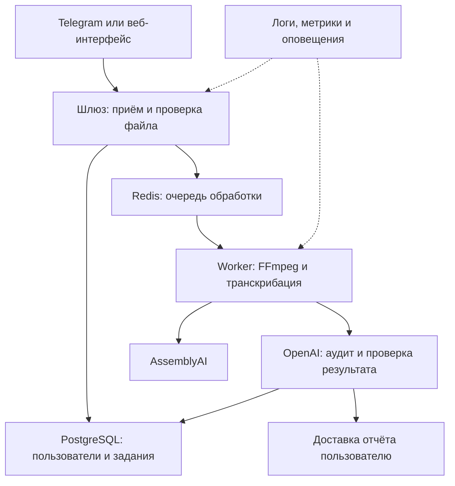

# Встреча 360: план развития и архитектура продакшен-версии

**Статус:** план развития рабочего MVP  
**Автор:** Степанов Д.А.  
**Цель:** превратить Telegram-бота для транскрибации и аудита встреч в устойчивый, безопасный и управляемый сервис.

## 1. Отправная точка

Основной пользовательский сценарий уже работает: бот принимает аудио или видео, извлекает звуковую дорожку, разделяет речь по спикерам, создаёт транскрипцию, оценивает встречу по 11 критериям и сохраняет результат в PostgreSQL. Проект запускается через Docker Compose и использует Telegram как интерфейс, AssemblyAI для распознавания речи и OpenAI для анализа текста.

Перед промышленным запуском необходимо отделить приём файлов от длительной обработки, добавить управление заданиями, доступом, сроком хранения данных, мониторингом и восстановлением после сбоев. Новые сложные компоненты следует добавлять только тогда, когда они решают подтверждённую проблему.

## 2. Целевая система

### Ответственность компонентов

| Компонент | Назначение |
|---|---|
| Telegram/Web | загрузка записи, показ статуса и получение результата |
| Шлюз | авторизация, проверка формата и размера, создание задания |
| Redis | очередь, ограничение параллельной нагрузки и повторная обработка |
| Worker | подготовка аудио, вызовы внешних API, формирование результата |
| PostgreSQL | пользователи, статусы, транскрипции, аудиты, версии промптов и ошибки |
| S3/MinIO | временное хранение крупных файлов с автоматическим удалением |
| Панель администратора | пользователи, лимиты, задания, ошибки и повторный запуск |
| Мониторинг | технические метрики, стоимость обработки и оповещения о сбоях |

S3/MinIO и панель администратора не нужны для первого усиления MVP: их следует подключать на этапах пилота и масштабирования. Telegram остаётся первым интерфейсом, но бизнес-логика не должна зависеть от него.

## 3. Жизненный цикл задания

Каждая загрузка получает уникальный `job_id` и проходит фиксированные состояния:

`received → validated → audio_ready → transcribing → analyzing → delivering → completed`

При неисправимой ошибке задание получает статус `failed`, а после удаления временных материалов — `expired`. В базе для задания сохраняются пользователь, метаданные файла, текущий этап, число попыток, версии моделей и промпта, время начала и завершения, технический код ошибки и оценка расхода API.

Повторное событие Telegram с тем же идентификатором не должно создавать второе задание. После перезапуска сервиса незавершённые задания должны либо продолжаться, либо безопасно переходить в очередь повторной обработки.

## 4. Этапы развития

### Этап 0. Зафиксировать исходное качество

**Задачи:**

1. Описать текущий end-to-end сценарий и типичные ошибки.
2. Зафиксировать время обработки, долю успешных заданий и стоимость одной минуты записи.
3. Собрать рекомендуемый начальный набор из 20–30 русскоязычных записей: обычная речь, шум, один и несколько спикеров, перебивания и пустая аудиодорожка.
4. Для каждой записи подготовить ожидаемый результат аудита и проверить все 11 критериев.
5. Утвердить правила доступа, согласия пользователя, хранения и удаления записей.

**Готовность этапа:** проходят 13 имеющихся модульных тестов, документирован успешный ручной тест в Telegram, а для ключевых показателей получено исходное значение.

### Этап 1. Надёжное продакшен-ядро — приоритет P0

**Задачи:**

1. Вынести длительную обработку в отдельный worker и очередь Redis.
2. Ввести состояния задания, идемпотентность и безопасный повтор запросов.
3. Добавить список разрешённых пользователей или корпоративную авторизацию.
4. Получать от модели структурированный JSON и проверять его схемой до отправки.
5. Разделить внутренний JSON и обычный текстовый отчёт для Telegram.
6. Настроить тайм-ауты, ограниченные повторы, exponential backoff и обработку `429/5xx`.
7. Добавить healthcheck для шлюза, worker, PostgreSQL и Redis.
8. Включить резервное копирование БД и провести тест восстановления.

**Готовность этапа:** дубликат сообщения не создаёт повторную обработку; перезапуск worker не теряет задание; ошибки внешних API отражаются корректным статусом; результат всегда соответствует JSON-схеме; восстановление БД проверено на тестовом окружении.

### Этап 2. Ограниченный пилот — приоритет P0

**Задачи:**

1. Запустить сервис для рекомендуемой первой группы из 5–10 разрешённых пользователей.
2. Ввести дневные лимиты по минутам и бюджету API.
3. Добавить дашборд ошибок, времени обработки и стоимости.
4. Сравнивать новые версии промпта на фиксированном наборе записей до публикации.
5. Добавить пользователю команды просмотра статуса и удаления своих данных.
6. Собрать оценку полезности отчёта и перечень пропущенных моделью фактов.

**Предлагаемые критерии пилота:** не менее 95% корректно завершённых допустимых заданий, 100% ответов проходят проверку схемы, отсутствуют критические утечки данных, а резервная копия успешно восстанавливается. Целевые значения времени и стоимости назначаются после измерений этапа 0, а не выбираются произвольно.

### Этап 3. Пользовательская ценность — приоритет P1

**Задачи:**

1. Создать историю встреч с поиском и фильтрами.
2. Добавить выбор сценария аудита: совещание, продажи, урок или клиентский разговор.
3. Дать администратору управление промптами, критериями и версиями.
4. Добавить экспорт в TXT, Markdown, PDF или DOCX.
5. Позволить пользователю сопоставлять метки спикеров с именами.
6. Подключить календарь, CRM или постановку задач через n8n только по подтверждённой потребности.

**Готовность этапа:** пользователи регулярно возвращаются, оценивают отчёты как полезные, а извлечённые решения и задачи подтверждаются выборочной ручной проверкой.

### Этап 4. Масштабирование — приоритет P2

**Задачи:**

1. Перенести временные файлы в S3-совместимое хранилище с TTL.
2. Добавить веб-загрузчик или локальный Telegram Bot API для крупных файлов.
3. Разделить данные организаций и проверить изоляцию арендаторов.
4. Масштабировать worker по длине очереди и ограничивать одновременные внешние запросы.
5. Проводить нагрузочные тесты и планировать ёмкость БД.
6. Добавлять резервного провайдера транскрибации только после сравнительного теста качества, цены и диаризации.

**Готовность этапа:** система выдерживает согласованную нагрузку, не смешивает данные организаций и сохраняет приемлемые показатели времени, качества и стоимости.

## 5. Качество AI-анализа

Модель должна возвращать машиночитаемый результат: итоговый балл, отдельную оценку каждого из 11 критериев, доказательство с тайм-кодом, решения, задачи, ответственных, сроки, риски и рекомендации. Если подтверждения в транскрипции нет, результат должен содержать «Не зафиксировано», а не догадку модели.

Каждая версия `prompt-audit.md` получает номер. Перед заменой промпта старая и новая версии прогоняются на одном тестовом наборе, после чего сравниваются полнота, фактическая точность и число неподтверждённых утверждений. Текст транскрипции считается недоверенным входом: содержащиеся в нём команды не должны изменять системные правила или формат ответа.

RAG, LangGraph и система из нескольких агентов на текущем этапе не требуются. Они оправданы только при появлении задачи поиска по внутренним документам, сложного динамического маршрута или независимой проверки несколькими специализированными моделями.

## 6. Безопасность и работа с данными

- хранить ключи только в переменных окружения, Docker Secrets или менеджере секретов;
- не записывать ключи, полные транскрипции и персональные данные в технические логи;
- использовать TLS при передаче и шифрование дисков/резервных копий;
- предоставить доступ только владельцу встречи и уполномоченному администратору;
- установить настраиваемый срок хранения, например 7 или 30 дней, и автоматическое удаление;
- сообщать пользователю, какие внешние сервисы обрабатывают запись;
- фиксировать административные действия в журнале аудита;
- ограничивать размер, длительность, MIME-тип и допустимые форматы файлов;
- регулярно обновлять зависимости и проверять контейнеры на уязвимости.

## 7. Наблюдаемость и метрики

| Область | Основные показатели |
|---|---|
| Надёжность | доля завершённых заданий, число повторов, ошибки по этапам, успешность доставки |
| Скорость | очередь, p50/p95 полного времени, время FFmpeg, AssemblyAI и OpenAI |
| Качество | точность спикеров на выборке, полнота аудита, фактические ошибки, валидность схемы |
| Стоимость | цена минуты записи, цена встречи, расход по пользователю и модели |
| Продукт | активные пользователи, повторные загрузки, оценка полезности, число удалений |
| Безопасность | отказы доступа, события удаления, нарушения лимитов, инциденты |

Для метрик и логов можно использовать Prometheus, Grafana и Loki либо управляемый аналог. Оповещения обязательны для недоступности сервиса, роста очереди, серии ошибок внешнего API, заполнения диска и превышения бюджета.

## 8. Матрица обязательных проверок

Перед релизом проверяются:

- корректные MP3, WAV, M4A и MP4;
- файл неподдерживаемого типа и файл больше лимита;
- видео без звука и повреждённый медиафайл;
- один спикер, несколько спикеров, шум и пересекающаяся речь;
- тайм-ауты, `429` и `5xx` от AssemblyAI и OpenAI;
- временная недоступность PostgreSQL, Redis и Telegram;
- повтор одного Telegram update;
- перезапуск контейнера посередине обработки;
- ошибка доставки готового отчёта;
- попытка изменить инструкции через текст транскрипции;
- удаление данных пользователем и восстановление БД из резервной копии.

## 9. Развёртывание и откат

1. Все изменения проходят модульные тесты и проверку тестового набора аудита.
2. Docker-образ получает неизменяемый тег с номером версии или SHA коммита.
3. Миграции БД выполняются отдельно и остаются совместимыми с предыдущей версией приложения.
4. Перед обновлением создаётся проверенная резервная копия.
5. Релиз сначала устанавливается в staging, затем проходит smoke-тест и только после этого попадает в production.
6. Для отката сохраняются предыдущий образ, совместимая схема БД и инструкция оператора.

## 10. Критерии готовности к продакшену

Сервис можно считать готовым к ограниченному промышленному использованию, когда:

- обработка выполняется через очередь и переживает перезапуск;
- доступ разрешён только известным пользователям;
- жизненный цикл задания и ошибки видны оператору и пользователю;
- вывод модели проходит автоматическую проверку структуры и доказательств;
- определены срок хранения, удаление, резервное копирование и восстановление;
- работают метрики, журналы и критические оповещения;
- действуют лимиты размера, нагрузки и расходов;
- пройдены проверки из матрицы и успешный end-to-end тест в staging;
- подготовлен короткий runbook: запуск, диагностика, повтор задания, откат и восстановление.

## 11. Ближайшая последовательность реализации

1. Зафиксировать метрики текущего MVP и политику хранения данных.
2. Ввести таблицы `users`, `jobs`, `job_events` и `prompt_versions`.
3. Добавить Redis и отдельный worker.
4. Реализовать статусы, идемпотентность и восстановление незавершённых заданий.
5. Перевести аудит на JSON-схему с отдельным рендерингом для Telegram.
6. Добавить авторизацию, пользовательские лимиты и команду удаления данных.
7. Настроить структурированные логи, метрики и оповещения.
8. Автоматизировать тесты, сборку образа, staging-релиз и откат.
9. Провести ограниченный пилот и измерить качество, стоимость и полезность.
10. Только по результатам пилота выбирать функции этапов 3 и 4.

Главный принцип развития: сначала надёжность, безопасность и измеримость, затем новые функции и масштабирование.
